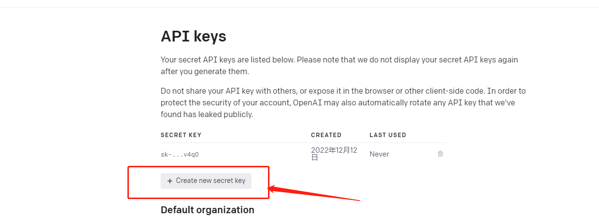
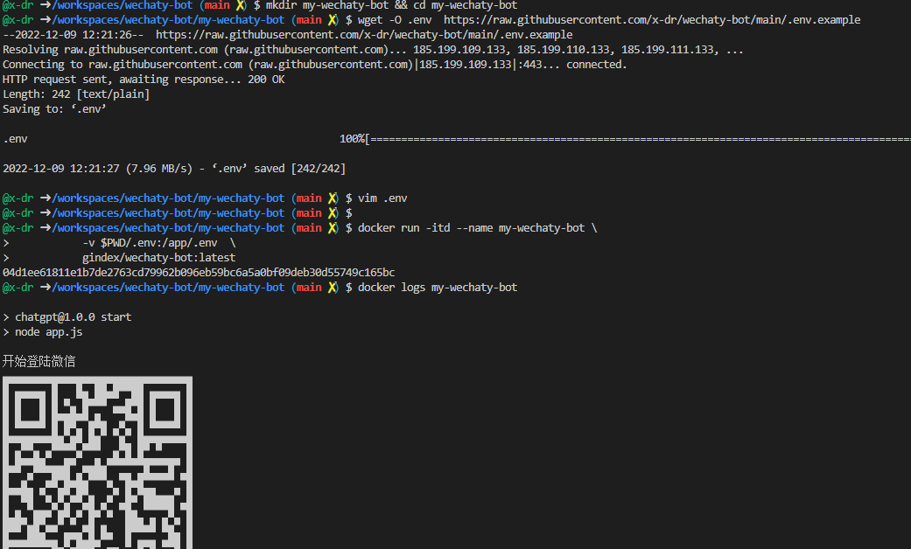
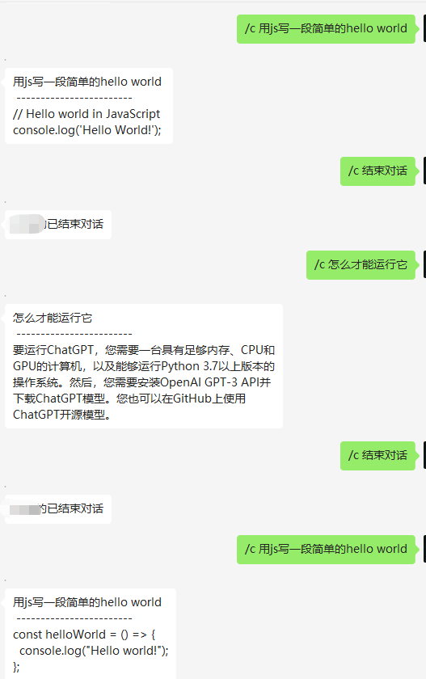
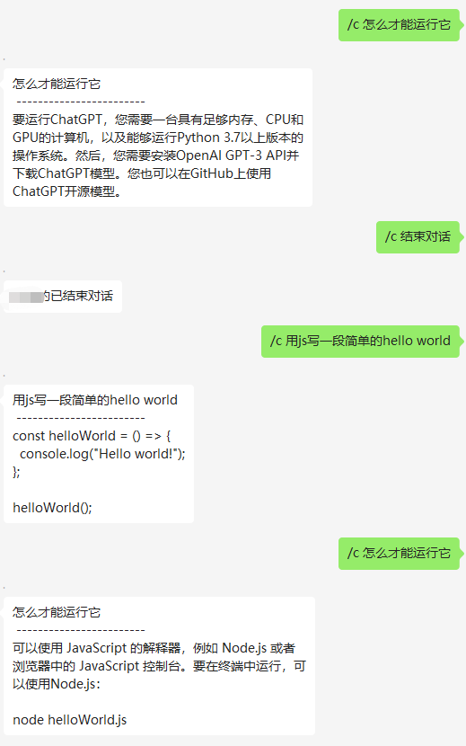
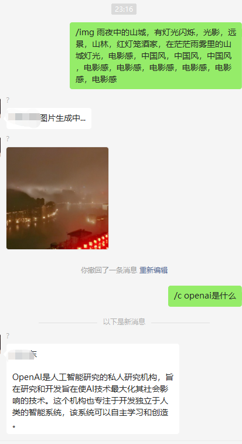
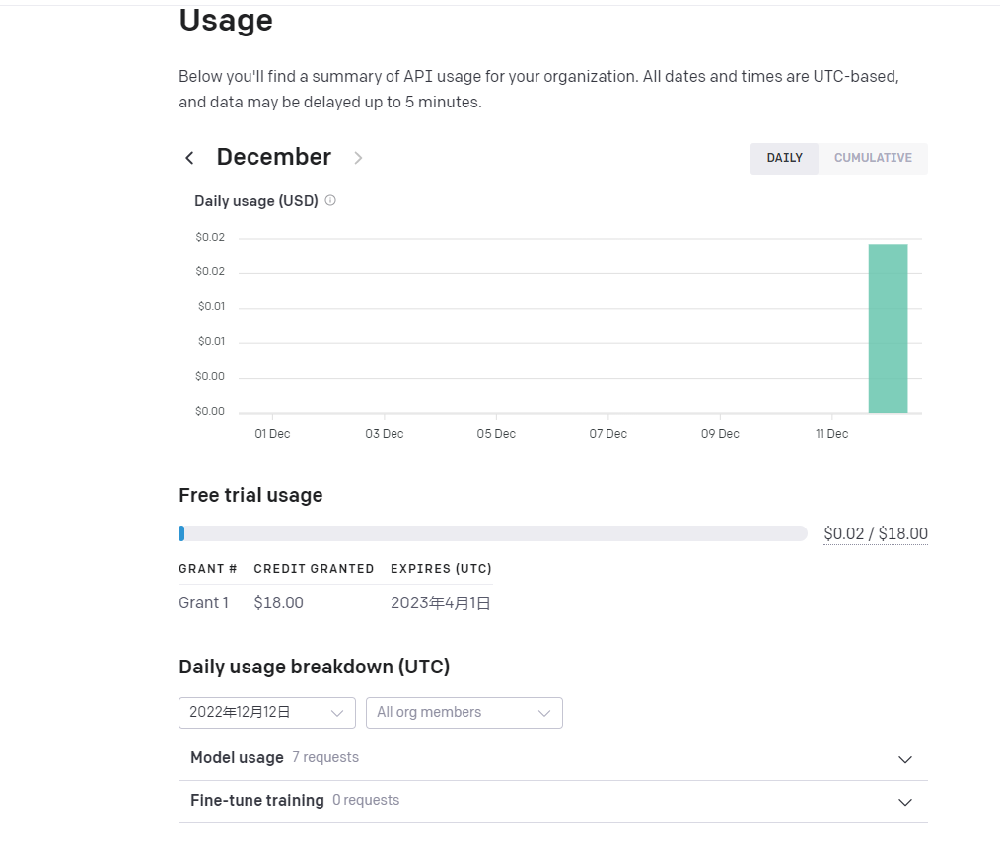

# ChatGPT Bot

[新版微信机器人](https://github.com/x-dr/wechat-bot)


<details>

<summary>旧版，不建议使用</summary>

**封号严重不建议使用**

一个 基于 `OpenAI` + `Wechaty` 智能回复、支持上下文回复、AI绘画的微信机器人,可以用来帮助你自动回复微信消息。


#### 反向代理 api.openai.com

api.openai.com 国内无法访问，利用Cloudflare Workers反向代理,[教程](./docs/cf_worker.md)

当你的环境无法使用，不想自建，也可以用我的`https://openai.1rmb.tk`。

### 准备

<details>

<summary>准备</summary>

+ 1、先获取自己的 api key，地址 ：[创建你的 api key](https://beta.openai.com/account/api-keys) 
> API Key 创建成功。复制好这个Key接下来会用到。点击OK后，Key不会再完整显示。只能删了重新生成Key！
> 如果没账号，可以参考V2EX上这个帖子注册 地址[https://www.v2ex.com/t/900126](https://www.v2ex.com/t/900126)




```bash
# $wechaty-bot
# 执行下面命令，拷贝一份 .env.example 文件
cp .env.example .env
```

```bash
#群聊chatgpt自动回复总开关 0为关闭 1为开启
AutoReplyGroup = 1
#开启chatgpt群聊列表，群聊名称必须与微信群聊名称一致，否则无法自动回复 为空则自动回复所有群聊 ["群聊1","群聊2","群聊3"]
RoomList = [ ]
#好友chatgpt自动回复总开关 0为关闭 1为开启 
AutoReplyFriend = 1
#开启chatgpt好友列表，好友名称必须与微信好友名称一致，否则无法自动回复 为空则自动回复所有好友 ["好友1","好友2","好友3"]
FriendList = [ ]
# openai的key，需要自己去获取 ，地址：https://beta.openai.com/account/api-keys
OPENAI_API_KEY ='sk-xxxxxxxxxxxxxxxxx'
# 反代的api,为空时为默认值 https://api.openai.com
PROXY_API = ''


```
</details>


### 启动服务
<details>
<summary>使用Docker</summary>
#### 1、使用Docker

<!-- + 1、安装 `docker` 和 `docker-compose`，地址 ：[https://docs.docker.com/compose/install/](https://docs.docker.com/compose/install/) -->

下载并编辑`.env`配置文件
```bash
mkdir my-wechaty-bot && cd my-wechaty-bot
wget -O .env  https://raw.githubusercontent.com/x-dr/wechaty-bot/main/.env.example 
vim .env

```

> 运行
```bash
docker run -itd --name my-wechaty-bot \
            --restart=always \
           -v $PWD/.env:/app/.env  \
           gindex/wechaty-bot:latest
                    
```
> 查看日志扫码登录
```bash
docker logs my-wechaty-bot -f
```




> 自行打包docker镜像
```bash
docker build -t wechaty-bot .
docker run -it --rm --name wechaty-bot wechaty-bot
```
</details>

#### 2、本地启动

<details>
<summary>本地启动</summary>

```bash
git clone https://github.com/x-dr/wechaty-bot.git
npm i
node app.js
```
> 就可以扫码登录了。


用pm2启动后台运行
```
npm install pm2 -g

pm2 start app.js
```


</details>

### 使用

<details>

<summary>使用</summary>

+ 智能回复
```
/c xxxx   #对话

/c 结束对话  #结束本轮对话

```




+ AI绘画
```
/img xxx
```


</details>


### 费用情况


openai是要付费的，价格的计算方式不是简单的按照请求次数计算，包括相应内容的文字的多少。新账号有18美元免费额度。


> 官方价格：https://openai.com/api/pricing



### 故障排除
+ [Chrome 依赖](./docs/puppeteer-error.md)


### 感谢

[@wechaty](https://github.com/wechaty/wechaty)

[@transitive-bullshit](https://github.com/transitive-bullshit/chatgpt-api)

</details>
